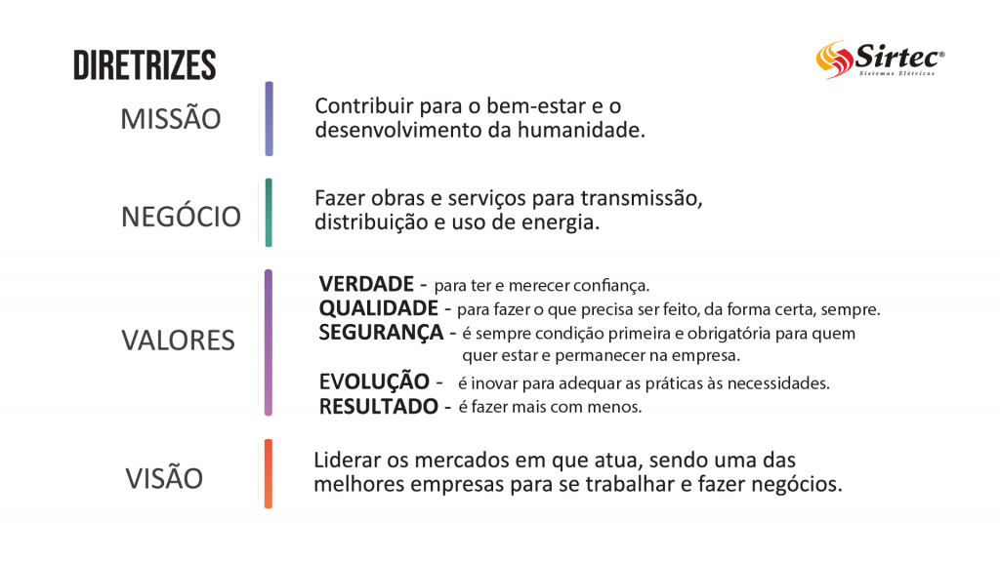

# Sobre nós

## Diretrizes

## Nossos Serviços

Na Sirtec, tudo o que desenvolvemos é para conduzir o progresso com segurança até as regiões mais distantes.

## Construção de Redes Elétricas
Executamos as ações previstas nos projetos de redes elaborados por nós ou terceiros, empregando equipes qualificadas e providas de veículos e equipamentos pesados.

## Manutenção Pesada de Redes Elétricas
Também executamos manutenções corretivas, preventivas, substituição de postes, além de outros equipamentos como transformadores, reguladores ou capacitores.

## Manutenção e Atendimento de Emergência
Possuímos profissionais qualificados e veículos equipados para acesso a locais difíceis, assegurando o rápido restabelecimento da rede de energia com a qualidade e segurança de nossa ágil assistência.

## Corte e Religue
O emprego de motocicletas facilita o deslocamento das equipes, tanto em áreas rurais e urbanas, onde são realizados os cortes por falta de energia por falta de pagamento ou ligação após quitação da dívida.

## Obras e Serviços para Uso de Energia Elétrica
Realizamos a melhoria ou racionalização dos serviços de manutenção em sistemas de iluminação pública, implantação ou instalação de redes e equipamentos para uso de energia elétrica.

### Todos os nossos serviços seguem rígidos padrões de segurança impostos pelas normas técnicas do setor e programas da própria Sirtec. Tantos cuidados demonstram a preocupação que temos em oferecer aos clientes e usuários os melhores serviços junto à energia indispensável ao progresso.

# Sirtec Sistemas Elétricos